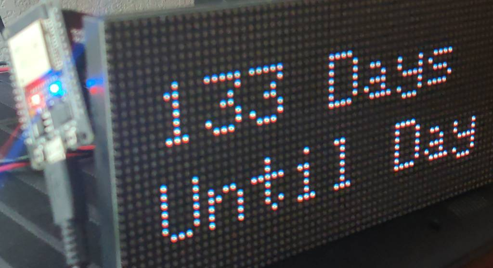

# ESP32 Countdown LED Matrix
---
### Credit goes to [rznazn](https://github.com/rznazn/Christmas_count_down) for the orginal program.



#### Note: The Wi-Fi and PxMatrix LED libraries must be installed for this program to function.

## Setting Wi-Fi
To set the Wi-Fi, change the following lines in `esp32-countdown.ino`.

```
// Set Wi-Fi name and Password here
const char* ssid       = "My SSID";
const char* password   = "My Password";
```

## Setting Timezone
The upstream timezone is UTC, to change the following line to offset the time for your timezone. For example, this would be the offset for Central time.

```
// Timezone offset
const long  gmtOffset_sec = 3600 * -6;
```

## Setting Countdown Day
The default day to countdown to is Christmas Day, to adjust the day, subtrack the the number of days between the day that you want to countdown to, and chrismas day. Then adjust the following line replacing zero with the desired number.

```
  // Change Day
  daysTill = (daysTill - 0);
```

## Changing Countdown Message
By default the message is "Until Day", and to change the message, go to the following code block. Just note that the message cannot be longer than 10 characters or it will not display properly.

```
  // Change Day
  daysTill = (daysTill - 0);
```

## Turn Display off During Certain Times
The current time is stored in the 24-Hour Format, and to disable the display, just create an if statement after line 137. For example, this would turn off the display at midnight.
```
    if (timeinfo.tm_hour == 24) {
     display.clearDisplay();
    }
```

## Change Display Brightness
To change the display brightness, change any of the of the following lines to the desired value.

`display.setBrightness(200); // Set Display Brightness Default is 255`

## Limitations
It is untested if leap years are calculated properly.

## Compatible boards
Tested on the DOIT ESP32 DEVKIT V1
